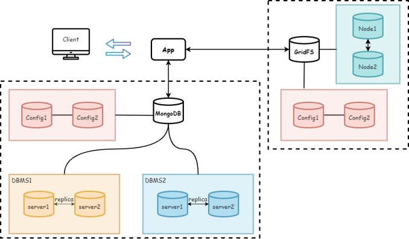

# Mongo-Cluster for DDBS


We would like to build an application for querying various articles, providing users, their reading record and show the popular article ranking .



## Feature

- Retrieval function (to get correct data)
- Distributed dataSet up replica for more reliability
- Monitor sytem (MongoExpress, MongoCompass …) → data analysis
- Backup system
- Easy to add server to cluster

## Environment

We recommend to run this project in Linux because all functions are tested in Ubuntu20.04. 

Running in Windows is also available. Before running you need to install docker for windows with WSL.

## Dependency

1. Docker

2. Docker-compose

3. Python3
   - pymongo
4. Makefile (optional)

## Run

### Makefile

If you have `make`, check this part. If you have not `make`, please check [without makefile](#without-makefile).

Run the following command to build up all things.

```
make all
```

 

There have some optional command enable you to build step by step:

```sh
make up # docker up all containers
make init # initialize database
make load # load all table to mongodb
make load_media # load all article to gridfs
make sharding # sharding data, generate poprank and beread table
make down # docker down all containers
make clean # docker down all containers and remove all volumes
```


### Without Makefile

If not type the following code in the command line in the project directory path

```sh
docker-compose up -d

# init db
docker exec -it cfg1 bash -c "mongosh < /init_scripts/init_cfg1.js"
docker exec -it cfg2 bash -c "mongosh < /init_scripts/init_cfg2.js"
docker exec -it dbms1-svr1 bash -c "mongosh < /init_scripts/init_dbms1.js"
docker exec -it dbms2-svr1 bash -c "mongosh < /init_scripts/init_dbms2.js"
docker exec -it gridfs1 bash -c "mongosh < /init_scripts/init_gridfs1.js"
docker exec -it gridfs2 bash -c "mongosh < /init_scripts/init_gridfs2.js"
docker exec -it router1 bash -c "mongosh < /init_scripts/init_router1.js"
docker exec -it router2 bash -c "mongosh < /init_scripts/init_router2.js"

# structure data
docker exec -it router1 bash -c "mongoimport --db ddbs --collection user --file /dataset/user.dat"
docker exec -it router1 bash -c "mongoimport --db ddbs --collection article --file /dataset/article.dat"
docker exec -it router1 bash -c "mongoimport --db ddbs --collection read --file /dataset/read.dat"

# media
python3 store_media.py

# sharding
docker exec -it router1 bash -c "mongosh < /init_scripts/do_sharding-part1.js"
docker exec -it router1 bash -c "mongosh < /init_scripts/do_sharding-part2.js"
docker exec -it router1 bash -c "mongosh < /init_scripts/do_sharding-beread.js"
docker exec -it router1 bash -c "mongosh < /init_scripts/do_sharding-poprank.js"

```


## Backup

run `backup` script, which will copy docker volumes to `volumes` directory with preserved privilege. Make sure you are root or have `sudo` privilege.

```
./backup
```


## Expansion

You can add modify `docker-compose.yml` and `init_scripts` to add or remove replication server.

For example if you want to add a server in `dbms1`, you can add following configurations in `docker-compose.yml`

```yaml
  dbms1-svr3:
    container_name: dbms1-svr3
    image: mongo:6.0.1
    command: mongod --shardsvr --replSet dbms1 --port 27017 --dbpath /data/db
    ports:
      - 27302:27017
    volumes:
      - ./init_scripts:/init_scripts
      - dbms1-svr3_db:/data/db
      - dbms1-svr3_cfg:/data/configdb
      
......

volumes:
  ...
  dbms1-svr3_db:
  dbms1-svr3_cfg:
  ...
```

In addition, change following configurations to `init_scripts/init_dbms1.js`.

```javascript
rs.initiate({
    _id: "dbms1", 
    members: [
        { _id: 0, host: "dbms1-svr1:27017"},
        { _id: 1, host: "dbms1-svr2:27017"}
        { _id: 2, host: "dbms1-svr3:27017"}
    ]
})
```


## Mongo-Express Monitor

After starting the system, you can operate database through mongo-express on browsers. you can Check `http://localhost:8081` to access it.

Because currently the monitor is not set the password and can be accessed by anyone. Thus, if you want to make database safer, you can set user name and password in `docker-compose.yaml`.

```yaml
monitor1:
    ...
    environemnt:
        ...
        ME_CONFIG_BASICAUTH_USERNAME: set_username_here
        ME_CONFIG_BASICAUTH_PASSWORD: set_passwd_here
    ...
```


## Misc

I succeed to connect `mongodb` with `pymongo`. The python script is in `test.py`

I succeed to get image and video. The python script is in `read_media.py`

Notice that currently the port of my `mongodb-ddbs` is **27100** for structure data, and `mongodb-gridfs` is **27101** for article stuff.


